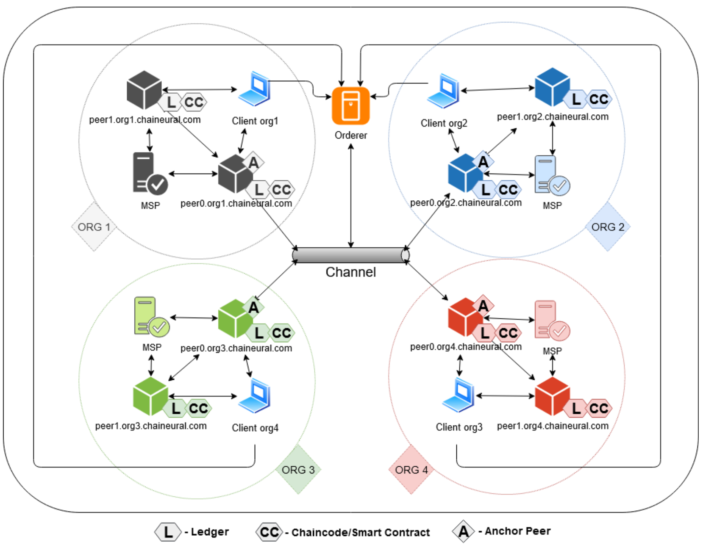
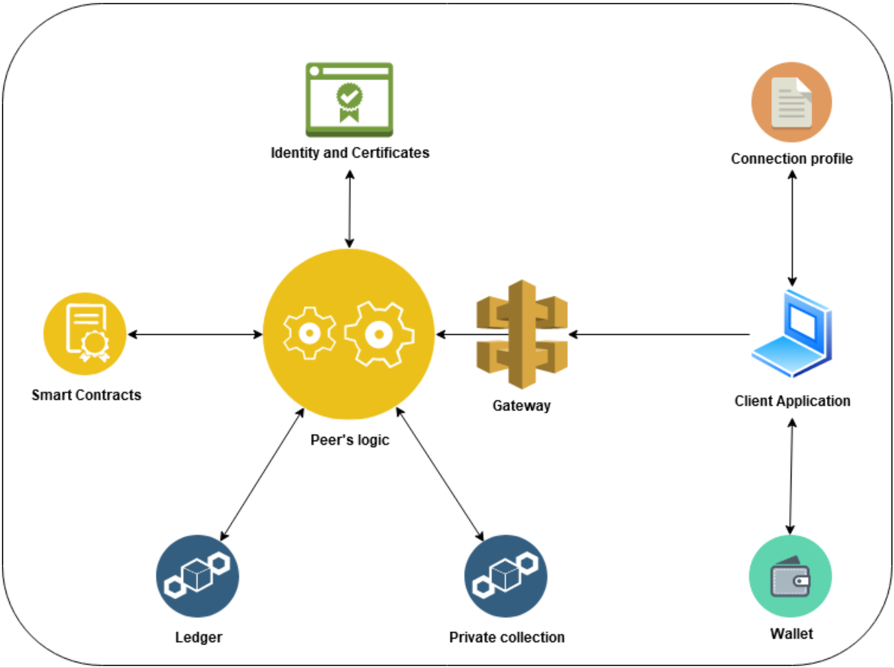

# Chaineural
Blockchain-based distributed neural network


## Description

Chaineural is a simulation of a distributed artificial neural network system, secured and monitored by blockchain. The former has been designed in an actor model fashion with each actor constituting a cluster. The whole learning process is based on the Asynchronous Stochastic Gradient Descent (ASGD) learning algorithm with parameters’ updates happening asynchronously, providing a concept of parameters’ staleness. Blockchain has been utilized in order to verify all the mini batches’ evaluation through the model. Additionally, it validates the correctness of each epoch evaluation by comparing the results, retrieved from the worker-actors, representing each organization. There has been the impact of the mini batches’ sizes alongside the amount of workers on the staleness of the parameters in the ASGD analyzed. It not only proves the appropriateness of the algorithm implementation, but also serves as an attempt to discover the dependence of the learning algorithm on the aforementioned hyperparameters.

## Prerequisites

- NPM, Node, Docker, Docker Compose mentioned for Hyperledger Fabric 1.4.4 in documentation https://hyperledger-fabric.readthedocs.io/
- Python 3.7
- Scala 2.13.1+ with Java

## Modules and architecture


## Blockchain infrastructure

Architecture
Since the Hyperledger Fabric is based on the docker containers, which all represent some entities, such as: node, chaincode, or some other services, we are able to depict relationships between them.




Chaineural’s blockchain network consists of:
- the main channel;
- the SOLO orderer service for simulation purposes;
- four organizations, each of which includes:
  - a peer with the chaincode and the ledger;
  - an anchor peer with the chaincode and the ledger, which additionally endorses and commits transactions;
  - a membership provider;
  - a private collection to store sensitive data;
  - a client application for the artificial neural network Akka’s learning workers.

Usually, the Fabric’s peers make extensive use of:
- the smart contracts,
- the ledger,
- both identities and certificates,
- the private collection,
- the gateway.



In order to improve the deployment process, client applications are also maintained by the docker engine. All containers have the assigned credentials with the information about which organization they correspond to. They also store the wallets for identification. Client applications were implemented in the Node.js technology with the Express package, allowing external users to connect to the REST API gateway.

## Chaincode
Smart contract plays a role as a validator for transactions. In order to meet requirements of Chaineural, it has multiple functions to read and write the data as well as provides information through events that transaction was submitted into the ledger or rejected because of some reason. 
At the end of the epoch validation when the final mini batch is processing, all endorsing peers need to reach out for the same object that makes LevelDB can face with Multiversion Concurrency Control (MVCC) [57]. This control tells about inconsistency of data during the reading and writing set. To solve this problem chaincode uses composite keys which are based on many attributes. For example, in order to put a new state of an epoch by nodes to the ledger they utilize the following code:

```
const epochValidIndex = 'epochName~org~value~txId';
const key = ctx.stub.createCompositeKey(epochValidIndex,
  [epoch.epochName, org, JSON.stringify(epoch), ctx.stub.getTxID()]);
await ctx.stub.putState(key, Buffer.from('\u0000'));
```

Where the value of attribute ctx.stub.getTxID() always states as a unique id what makes key value also being one of its kinds.

In order to read epoch state, chaincode needs epochValidIndex, attributes which define result and using getStateByPartialCompositeKey method we are able to obtain state iterator. Iterating across collection, chaincode must split composite key for the sake of read values.
```
public async queryEpochIsValid(
  ctx: Context,
  epochName: string): Promise<boolean> {
  
  let epochInLedgerAsBytes = await ctx.stub.getState(epochName);
  if (!epochInLedgerAsBytes || epochInLedgerAsBytes.length === 0) {
    throw new Error(`${epochName} does not exist`);
  }
  
  let array = [];
  let epochIsValidIterator = await ctx.stub.
    getStateByPartialCompositeKey(
      'epochName~org~value~txId', 
      [epochName]
    )
  
  while (true) {
    let responseRange = await epochIsValidIterator.next();
      if (!responseRange || 
          !responseRange.value || 
           !responseRange.value.key) break;
      
      let objectType;
      let attributes;
      ({ objectType, attributes } = 
      await ctx.stub.splitCompositeKey(responseRange.value.key));
      const returnedValue = attributes[2];
      array.push(JSON.parse(returnedValue));
  }

  return array.every(this.isValidEpoch);
}

private isValidEpoch(element, index, array) {
  return (element["valid"] === true);
}
```
Events are being caught by EventsHubs, which register listening for certain events by the id of the chaincode and also by name of event. 

Chaineural implements events such as:
- InitEpochsLedger, which is triggered with the first event and once the initialization of an epochs ledger has succeeded;
- InitMinibatchEvent invoked every time a new mini batch is being saved into the ledger;
- FinalMinibatchEvent being run in case of initialization of the last mini batch in the epoch;
- FinishMinibatchEvent evaluated when the mini batch has finished.

Function responsible for events emit requires the name of the event and the payload, which should contain the current state of the object and the syntax is as follows example for FinishMinibatchEvent:
```
ctx.stub.setEvent(‘FinishMinibatchEvent’, Buffer.from(JSON.stringify(minibatch)));
```

## Private collections
Firstly, collections config was specified for each organization. Assumption was to isolate private data only to one particular institution and the system achieves it by defining proper collection’s policy.
```
[{
        "name": "collectionMinibatchesPrivateDetailsForOrg1",
        "policy": "OR('Org1MSP.member')",
        "requiredPeerCount": 0,
        "maxPeerCount": 3,
        "blockToLive": 0,
        "memberOnlyRead": false
    },
    {
        "name": "collectionMinibatchesPrivateDetailsForOrg2",
        "policy": "OR('Org2MSP.member')",
        "requiredPeerCount": 0,
        "maxPeerCount": 3,
        "blockToLive": 0,
        "memberOnlyRead": false
    },
    {
        "name": "collectionMinibatchesPrivateDetailsForOrg3",
        "policy": "OR('Org3MSP.member')",
        "requiredPeerCount": 0,
        "maxPeerCount": 3,
        "blockToLive": 0,
        "memberOnlyRead": false
    },
    {
        "name": "collectionMinibatchesPrivateDetailsForOrg4",
        "policy": "OR('Org4MSP.member')",
        "requiredPeerCount": 0,
        "maxPeerCount": 3,
        "blockToLive": 0,
        "memberOnlyRead": false
    }]
```
Chaineural fully takes advantage of the private collections provided by the Hyperledger Fabric in order to store the values corresponding to the time of processing a certain mini batch of data, as well as the obtained loss for each organization. These data are being put into the collections once the finish mini batch function is being invoked. Briefly, chaincode read transient data from the context and write it to proper collection by the putPrivateData method where we pass parameters of the collection name, key and value.
```
const transMap = ctx.stub.getTransient();
const result = {};
transMap.forEach((value, key) => {
  result[key] = value.toString();
});

let minibatchPrivateInfo: MinibatchPrivateInfo = {
  docType: 'minibatchPrivateInfo',
  minibatchNumber: minibatch.minibatchNumber,
  epochName: minibatch.epochName,
  learningTime: result['learningTime'],
  loss: result['loss']
}

const orgCapitalized = org.charAt(0).toUpperCase() + org.slice(1);
await ctx.stub.putPrivateData(
  'collectionMinibatchesPrivateDetailsFor' + orgCapitalized, 
  minibatch.epochName + '-minibatch' + minibatch.minibatchNumber, 
  Buffer.from(JSON.stringify(minibatchPrivateInfo))
);
```
## Business logic
Components

Business logic plays role as a transmitter and converter of data, which is situated between networks and the final user. Due to many components, all state as           a whole Chaineural system and consists of:
- Libraries (connection with the Hyperledger Fabric):
  - ChannelLib provides functions to invoke and query transactions,
  - ChaincodeLib serves information about installed and instantiated chaincodes,
  - HelperLib based on common connection profile facilitates access to the Fabric’s components such us:
    - Channels,
    - List of organizations,
    - Clients,
    - EventHubs;
- The Logic links almost all components together, making it the center of business logic. The Module specifies and steers work of the Chaineural system and behaves as a trigger for the services, gateway and an event emitter module. It manages the flow of the data and distorts it for the project purposes;
- Services:
  - Akka Service exchanges the data with the Akka Network
  - Contract Event Service, which
    - listens for the events emitted by the smart contract,
    - forwards events to the Event Emitter;
- API Gateway as a front-end communication point;
- Event Emitter immediately forwards events to the interface once they occur.

## Common connection profile

In order to provide necessary information about blockchain infrastructure for users, business logic must contain a common connection profile also known as    a network config, which includes information about the network topology, e.g. channels, organizations, peers, orderers, certificate authorities, etc.; and stores certificates for each entity to fulfill the role of the Fabric security.

Some functions require invoking all the nodes in order to obtain certain data. For example to obtain averages of learning time and loss, business logic needs to query the chaincode on peer because of private collections, which are accessible for a particular node. Such a situation takes place if the user clicks the button labeled Show details after the succeeded epoch’s validation.


## Relations between components

Its hierarchy makes it easy for modifications and facilitates future development. Furthermore segregation of duties supports us in investigation for potential bugs and accelerates our activities in code.


## Front-end
- Framework
Interface is based on the  Angular framework and plays a role as a dashboard for the user, who has a desire to manage and monitor all major interactions between the blockchain infrastructure and the Chaineural’s artificial neural network. The dynamic application provides basic information about what Chaineural actually consists of, also allows the user to choose a current peer from the navigation bar, from which requests will be sended.

The Dashboard includes three components. The user is able to reach them thanks to the AppRoutingModule, responsible for routing, provided by Angular.

- Views
Firstly, application starts on the Home page, where details about the Hyperledger Fabric’s network are being displayed, such as:
- blockchain and the first four digits of the hash of each block,
- amount of blocks,
- number of peers,
- list of the instantiated chaincodes,
- list of the anchor peers for each organization,
- current channel connections between nodes.

To set all the information, Angular needs to ask business logic about them by sending some simple requests:
```
[GET] /api/channels - obtaining all existing channels in the network;
[GET] /api/peers-for-channel/<channelName> - getting the channel’s peers;
[GET] /api/anchor-peers/<channelName> - retrieving the anchor peers for the channel;
[GET] /api/channel-connections/ - getting the nodes’ connections;
[GET] /api/channel-blocks-hashes/<channelName>/<peer>/<organization> - obtaining all the existing channels in the network;
[GET] /api/chaincode/instantiated/<peer>/<typeOfChaincodes>/<organization> - retrieving all the existing channels in the network.
```
- Dashboard’s Home page view part I


- Dashboard’s Home page view part II


Second page called Preview is the heart of the interface. It gives the user capability to set parameters for the akka network, but before settings will be set inside akka, the user has to initialize epochs ledger on the blockchain and request akka by how many mini batches each epoch will have. Initialization is done by simply clicking the blue button Init Epochs Ledger and is sended by chosen peer on the navigation bar.

- Dashboard’s Preview page view


Following that, application displays all parameters configured by the user with the amount of mini batches, which was mentioned above and shows the table with epochs and their details about name, if is valid or not and currently provided mini batches. Yellow button includes a transaction id, which is accompanied with initialization of the ledger. Now users are able to start the learning process by clicking the button and thus sending a request directly to the Chaineural’s artificial neural network.

- Dashboard’s Preview page view with the initialized epochs.


Subsequently, out of the box, the dashboard receives events, which are passed to view of the user. At this moment application behaves as a real-time monitoring for the akka and blockchain network. Table on the bottom illustrates learning divided into epochs and current work for each organization shown by its events. Progress bar informs about improvement in delivering mini batches onward in space of epoch. We can also notice the amount of mini batches provided in the epochs table, where color change is relative to the epoch’s status. Beige color tells us that learning of epoch has not yet begun, yellow about currently processed epoch and green about accomplishment of final state. Button Show details appears when epoch is valid and gives the user capability to display average learning time and it’s loss.

- Dashboard’s Preview page view with real time monitoring.


Finally, the Events component displays all history of events delivered from the events hubs included in Hyperledger Fabric, where single event consists of:
- name of the origin peer, that it comes from and it’s organization defines color of the record;
- name of the event;
- transaction id;
- block number;
- status;
- invoker, organization, which invoke transaction;
- payload.

On the Show button, the application reveals payload as a stringified JSON object above the table. 

- Dashboard’s Events page view.


## Relations between components

Angular architecture is comprised of:
- Services:
  - Network Service - connects with REST API Gateway;
  - Events Service - is always ready to receive newest event from the business logic;
- Components - include basic logic and manimulate the view for the user:
  - Dashboard Component,
  - Preview Component,
  - Events Component;
- Modules:
  - SharedModule - module for sharing the data among all components in the application;
  - AppModule - the core of the angular framework;
  - AppRoutingModule - responsible for switching between urls to components e.g /dashboard, /preview, /events.

- Angular components architecture.


## Integration

The Chaineural’s artificial neural network module communicates with the clients application via REST API gateways. Exemplar communication between the two might look like:
```
CLIENT: 
[GET] 192.168.0.108:8080/amountOfMiniBatches/200

ChaineuralNN: 
85

CLIENT: 
[POST] 192.168.0.108:8080/hyper, 
{
  "amountOfWorkers": 4,
  "synchronizationHyperparameter": 2,
  "featuresSize": 8,
  "hiddenSize": 20,
  "outputSize": 1,
  "epochs": 10,
  "eta": 0.02
}

ChaineuralNN: Cluster initialization proceeded

ChaineuralNN: 
[POST] 192.168.0.102:9001/api/init-minibatch/<epoch>/<miniBatch>/worker

Albert: 
[POST] 192.168.0.102:9001/api/finish-minibatch/<epoch>/<miniBatch>/<learningTime>/<loss>
```

- Hyperledger Fabric and Chaineural’s artificial neural network integration.


Firstly, the blockchain network is being initialized and connected to the client application. At the same time, Chaineural’s artificial neural network part starts the API gateway. Then, blockchain module sends a request providing a mini batch size and requires the amount of mini batches provided as a response. Once the blockchain's initialization process is finished, the user can provide required information from the web application's interface. The JSON request consists of hyperparameters such as the amount of epochs, learning rate, amount of workers, size of the artificial neural network hidden layer and finally a synchro- nization threshold value used in the process of distributed learning for the parameters’ update procedure. These hyperparameters are being provided respectively to the corresponding actors so that they can properly evaluate learning of an epoch. But meanwhile the whole Akka’s cluster is being spun up and the learning process begins. At the very beginning of the forward propagation of each mini batch through the artificial neural network, an HTTP request is being sent to the blockchain, containing the information about current epoch, mini batch and the fact that the actor started processing. Once the backpropagation is satisfied, each actor sends a request to the blockchain module once more; information provided consists of currently processed mini batch of a certain epoch, as well as the information about the achieved loss along with the processing time of both forward and backward propagation steps summed. 

This whole flow is only a fraction of the whole process of evaluating an epoch worth of mini batches. At the end of each epoch, there’s a validation process in which the organizations’ corresponding workers evaluate the same mini batch with the same, most recent, parameters. The blockchain part then checks if the requests’ values are equal, meaning that the epoch’s correctness validation process has succeeded. The learning process and epoch’s validation are being repeated as long as all the rules are continuously being satisfied or the amount of epochs processed has not exceeded the value provided at the initializing process in the beginning, resulting in the end of the learning process.

## Conclusion

Chaineural at this stage is still quite not there yet. Authors have focused on developing a distributed artificial neural network from scratch and utilizing the Hyperledger Fabric’s capabilities for both validating the learning process as well as tracking and securing the transactions. The two modules are implemented in the microservice fashion - they are fully independent of each other’s state, on top of that they communicate with each other via HTTP requests over the network in order not to share any resources. Due to strictly limited computational resources, the system's scalability could not have been tested properly; therefore, its fault tolerance and ability to handle big data as well. The Chaineural is more of               a simulation of the product it might become in the future, but all the core fundamental operations and processes are present.

The ultimate goal of the research was to prove whether the two technologies, namely - blockchain and distributed deep learning can create a cohesive and properly functioning system together. From the authors’ perspective it is indeed possible and can lead to very interesting and helpful solutions. It can be a very challenging process to find a perfect use-case for the blockchain technology in order for it not to feel purposely forced; however, once discovered, it gives one lots of features a system wouldn’t offer right away.

At this point Chaineural can serve as a starting point for any further development procedures, it can be extended into a very scalable application which could be then deployed online successfully.
